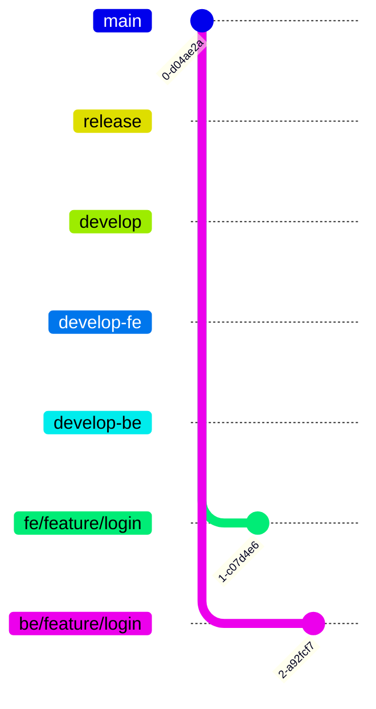

제공해주신 Git Flow 변형 전략(FE/BE 분리)과 컨벤션 규칙을 바탕으로, `README.md`에 바로 사용할 수 있도록 가독성 높게 정리해 드립니다.

Markdown의 **테이블, 코드 블럭, 인용문**을 활용하여 팀원들이 한눈에 규칙을 파악할 수 있도록 구성했습니다.

---

## 📋 Copy & Paste용 Markdown 내용

아래 내용을 복사하여 README에 붙여넣으세요.

```markdown
## 🐙 Git Convention

우리 팀은 **Git Flow**를 기반으로 하되, FE/BE의 원활한 병렬 개발을 위해 **중간 통합 브랜치(`develop-fe`, `develop-be`)**를 두는 전략을 사용합니다.

### 🌳 Branch Strategy



* **master**: 실제 라이브 서비스되고 있는 프로덕션 브랜치
* **release**: 배포 전 QA 및 테스트를 진행하는 브랜치
* **develop**: 다음 버전을 위한 개발 통합 브랜치
* **develop-fe / develop-be**: FE/BE 각 파트별 코드 충돌 방지 및 중간 통합을 위한 브랜치

#### 📂 브랜치 계층 구조

```text
master (Main)
└── release (QA/Test)
    └── develop (Integration)
        ├── develop-fe (Frontend Integration)
        │   └── fe/feature/login
        └── develop-be (Backend Integration)
            └── be/feature/login

```

---

### 🏷️ Branch Naming Rules

브랜치 생성 시 **[파트]/[타입]/[기능명]** 형식을 엄격히 준수합니다.

| 구조 | 설명 | 예시 |
| --- | --- | --- |
| **Prefix** | `fe/` 또는 `be/`를 반드시 접두어로 붙입니다. | `fe/...`, `be/...` |
| **Type** | 작업의 성격을 나타내는 키워드 | `feature`, `fix` 등 (하단 참조) |
| **Name** | 작업 내용을 직관적으로 알 수 있는 이름 | `login-api`, `main-page` |

#### 📌 Type 키워드 정의

| 타입 | 설명 | 사용 예시 |
| --- | --- | --- |
| `feature` | 새로운 기능 개발 | `fe/feature/signup-form` |
| `fix` | 이미 개발된 기능의 버그 수정 | `be/fix/oauth-token-error` |
| `hotfix` | master(배포) 단계에서의 긴급 수정 | `hotfix/payment-error` |
| `refactor` | 기능 변경 없는 코드 구조 개선 | `fe/refactor/folder-structure` |
| `test` | 테스트 코드 작성 및 수정 | `be/test/user-controller` |
| `chore` | 빌드, 패키지 설정, 라이브러리 추가 등 | `fe/chore/eslint-setup` |

---

### ⚠️ Workflow & Conflict Resolution (필독)

우리 프로젝트는 FE와 BE가 **병렬적으로 개발**을 진행합니다. 따라서 원격 저장소(Remote)와 로컬(Local) 간의 동기화가 매우 중요합니다.

> **🚨 주의사항: Push 전 Pull 필수!**
> 작업 후 바로 `push` 하지 마세요. 다른 팀원이 먼저 머지한 코드가 있을 수 있습니다.
> 반드시 **개발 중인 상위 브랜치(develop-fe/be)를 `pull` 하여 로컬에서 충돌(Conflict)을 해결한 뒤 `push**` 해야 합니다.

**작업 순서 예시 (FE 기준):**

1. `develop-fe`에서 `fe/feature/login` 브랜치 생성 및 작업
2. 작업 완료 후 커밋 (`git commit`)
3. 원격의 최신 변경 사항 가져오기 (`git pull origin develop-fe`)
4. 충돌 발생 시 로컬에서 해결
5. 원격 저장소로 업로드 (`git push origin fe/feature/login`)
6. GitHub에서 `develop-fe`로 Pull Request 생성

```

---

### 💡 작성 팁 (적용 시 참고하세요)

1.  **Mermaid 다이어그램 지원**: 위 코드에 포함된 ` ```mermaid ` 블록은 GitHub README에서 자동으로 시각적인 그래프로 렌더링됩니다. 구조를 이해하는 데 큰 도움이 됩니다.
2.  **이모지 활용**: 딱딱한 텍스트보다 🌳, 🏷️, ⚠️ 등의 이모지를 사용하여 시선을 집중시켰습니다.
3.  **강조 구문**: 팀원들이 가장 주의해야 할 `Pull` -> `Resolve Conflict` -> `Push` 과정을 인용문(`>`)으로 감싸 강조했습니다.

```