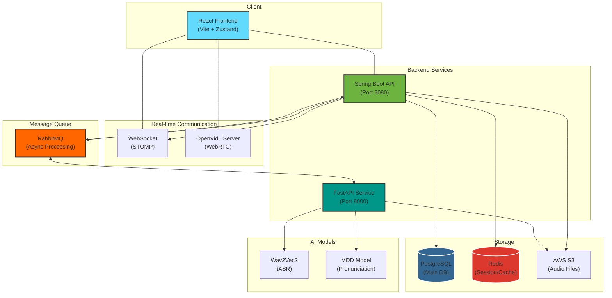
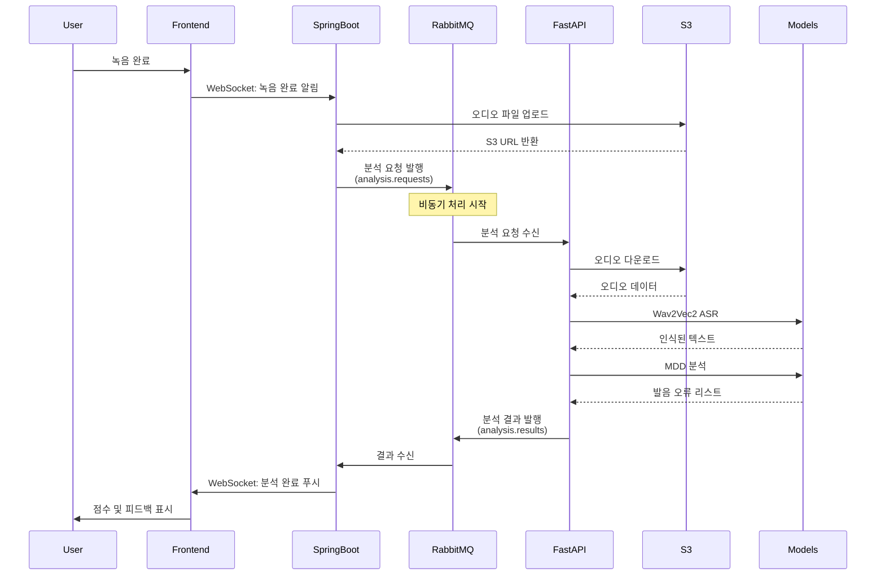
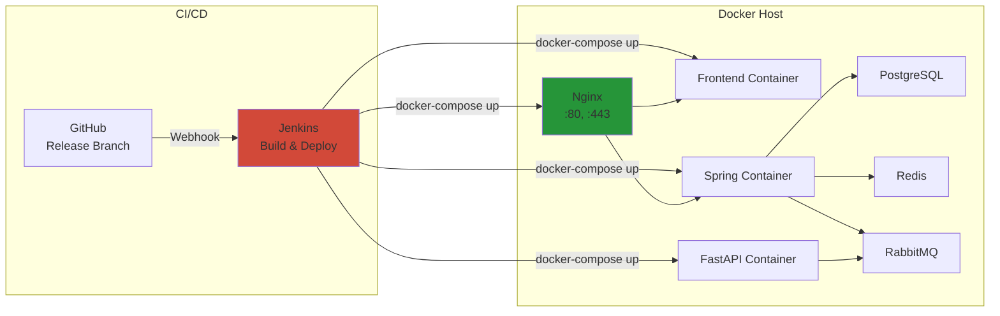
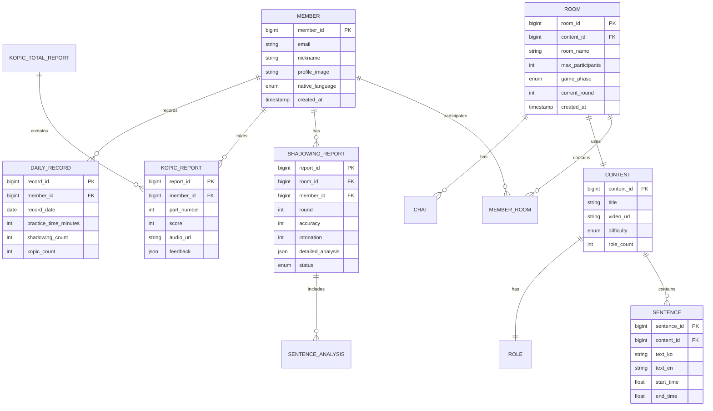
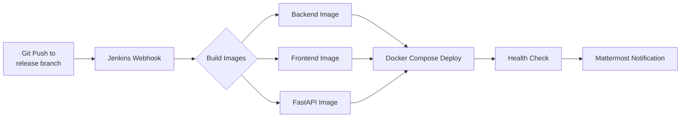

# 🎤 Meari (메아리) - AI 기반 한국어 발음 교정 플랫폼

<div align="center">


**WebRTC 기반 실시간 화상 연습 + AI 발음 분석을 결합한 한국어 학습 플랫폼**

[✨ 주요 기능](#-주요-기능) •
[🏗️ 아키텍처](#%EF%B8%8F-시스템-아키텍처) •
[🔥 기술적 챌린지](#-기술적-챌린지--해결-과정) •
[🚀 시작하기](#-시작하기)

</div>

---

## 📖 프로젝트 소개

### 💡 문제 정의

외국인 한국어 학습자들은 발음 교정에 어려움을 겪고 있습니다:
- **실시간 피드백 부재**: 혼자 연습할 때 발음이 정확한지 알 수 없음
- **접근성 제약**: 원어민 교사와의 1:1 수업은 비용이 높고 시간 제약이 큼
- **체계적 학습 부족**: 자신의 발음 향상 과정을 추적하기 어려움

### 🎯 해결 방안

Meari는 **AI 기술**과 **실시간 협업 기능**을 결합하여 이 문제를 해결합니다:

1. **AI 발음 분석**: Wav2Vec2 + MDD 모델로 발음 오류를 자동 탐지
2. **실시간 화상 연습**: WebRTC 기반 그룹 학습 세션
3. **즉각적 피드백**: 녹음 직후 정확도 및 억양 점수 제공
4. **학습 추적**: 대시보드로 발음 향상 추이 시각화

---

## ✨ 주요 기능

### 1. 🎥 실시간 그룹 연습 (쉐도잉)

```
👥 최대 4명 동시 입장
🎬 원어민 영상 시청 → 문장별 따라 읽기
🎙️ 실시간 녹음 및 AI 분석
📊 즉시 정확도·억양 점수 확인
```

- WebRTC(OpenVidu)를 통한 화상 통신
- 각 문장마다 개별 녹음 및 분석
- 라운드별 진행으로 체계적 학습

### 2. 🤖 AI 발음 분석

| 분석 항목 | 설명 | 기술 |
|---------|------|------|
| **음성 인식** | 사용자 발음을 텍스트로 변환 | Wav2Vec2 ASR |
| **발음 오류 탐지** | 틀린 발음, 생략된 음소 감지 | MDD (Mispronunciation Detection) |
| **정확도 계산** | 레퍼런스 대비 정확도 점수 | Levenshtein Distance |
| **억양 분석** | 원어민 발음과 비교 | 음성 특징 추출 |

### 3. 🏆 KOPIC 모의고사

- 한국어 말하기 능력 평가 시험 연습
- 6개 유형별 문제 제공
- AI 자동 채점 및 상세 피드백

### 4. 🎯 개인 연습 모드

- 혼자서도 학습 가능
- 원하는 콘텐츠 선택 및 반복 연습
- 기록 자동 저장

### 5. 📊 학습 대시보드

```
📈 일별/월별 학습 시간 통계
🎯 평균 정확도 추이 그래프
📝 연습 기록 상세 보기
🏅 레벨별 성취도 추적
```

---

## 🏗️ 시스템 아키텍처

### 전체 구조도



### 발음 분석 플로우



### 배포 아키텍처



---

## 🛠️ 기술 스택

### Backend

| 기술 | 버전 | 선택 이유 |
|------|------|----------|
| **Java** | 21 | 최신 LTS 버전, Virtual Threads 활용 |
| **Spring Boot** | 3.5.9 | 엔터프라이즈급 프레임워크, 풍부한 생태계 |
| **Spring Security** | 6.x | JWT 기반 인증/인가 |
| **JPA/Hibernate** | - | ORM으로 생산성 향상 |
| **PostgreSQL** | 15 | 안정성과 JSON 지원 |
| **Redis** | Alpine | 세션 저장소 및 캐싱 |
| **RabbitMQ** | 3 | 안정적인 메시지 큐, 재시도 정책 지원 |

### AI Service

| 기술 | 버전 | 선택 이유 |
|------|------|----------|
| **Python** | 3.11+ | AI/ML 생태계 |
| **FastAPI** | 0.109+ | 빠른 성능, 비동기 지원, 자동 문서화 |
| **Wav2Vec2** | - | 한국어 ASR에 높은 정확도 |
| **PyTorch** | 2.x | 딥러닝 모델 추론 |
| **Librosa** | - | 오디오 처리 |

### Frontend

| 기술 | 선택 이유 |
|------|----------|
| **React** 18 | 컴포넌트 기반 UI 개발 |
| **Vite** | 빠른 빌드 속도 |
| **Zustand** | 가벼운 상태 관리 |
| **TailwindCSS** | 빠른 스타일링 |

### DevOps & Infra

| 기술 | 용도 |
|------|------|
| **Jenkins** | CI/CD 파이프라인 |
| **Docker** | 컨테이너화 |
| **Docker Compose** | 멀티 컨테이너 오케스트레이션 |
| **Nginx** | 리버스 프록시, SSL 종료 |
| **AWS S3** | 오디오 파일 저장소 |
| **Cloudinary** | 이미지 저장 및 최적화 |

### Communication

| 기술 | 용도 |
|------|------|
| **OpenVidu** | WebRTC 서버 (화상 통신) |
| **STOMP over WebSocket** | 실시간 메시징 |
| **RabbitMQ** | 비동기 작업 큐 |

---

## 🗄️ 데이터베이스 설계

### ERD (주요 엔티티)



### 주요 테이블 설명

| 테이블 | 설명 |
|--------|------|
| **Member** | 사용자 정보 (이메일, 닉네임, 모국어 등) |
| **Room** | 쉐도잉 연습방 (최대 인원, 현재 라운드, 게임 단계) |
| **Content** | 연습 콘텐츠 (영상 URL, 난이도, 역할 수) |
| **Sentence** | 문장 데이터 (한글/영문 텍스트, 타임스탬프) |
| **ShadowingReport** | 쉐도잉 분석 결과 (정확도, 억양, 상세 분석 JSON) |
| **KopicReport** | KOPIC 시험 결과 (파트별 점수, 피드백) |
| **DailyRecord** | 일일 학습 기록 (연습 시간, 횟수) |

---

## 🔥 기술적 챌린지 & 해결 과정

### 1. 🚀 비동기 발음 분석 처리

**문제:**
- AI 발음 분석은 평균 5~30초 소요
- 동기 처리 시 사용자가 대기해야 하며, API 타임아웃 발생

**해결:**
1. **RabbitMQ 도입**: Spring Boot ↔ FastAPI 비동기 통신
2. **큐 기반 처리**: 분석 요청을 큐에 적재하고 FastAPI에서 소비
3. **WebSocket 알림**: 분석 완료 시 실시간으로 결과 푸시

```java
// Spring Boot: 분석 요청 발행
@Service
public class AnalysisProducer {
    public void publishAnalysisRequest(AnalysisRequestMessage message) {
        rabbitTemplate.convertAndSend("analysis.requests", message);
        log.info("분석 요청 발행: roomId={}, memberId={}",
                 message.getRoomId(), message.getMemberId());
    }
}

// FastAPI: 분석 요청 소비
@app.on_event("startup")
async def start_consumer():
    consumer = RabbitMQConsumer()
    await consumer.start_consuming()
```

**효과:**
- ✅ API 응답 시간 **30초 → 200ms** (99% 개선)
- ✅ 동시 분석 요청 처리 가능
- ✅ 사용자 경험 향상 (즉시 응답 + 백그라운드 처리)

---

### 2. 🎥 다중 사용자 WebRTC 동기화

**문제:**
- 4명이 동시에 화상 연결 + 음성 녹음
- 각 사용자마다 녹음 완료 시점이 다름
- 모든 사용자가 녹음 완료해야 다음 라운드 진행

**해결:**
1. **Redis로 녹음 상태 관리**
```java
// 녹음 완료 체크
public boolean checkAllRecordingsComplete(Long roomId, int round) {
    String key = "room:" + roomId + ":round:" + round + ":recordings";
    Long completedCount = redisTemplate.opsForSet().size(key);
    return completedCount == totalParticipants;
}
```

2. **STOMP 브로드캐스트로 상태 동기화**
```java
@MessageMapping("/room/{roomId}/recording/complete")
public void handleRecordingComplete(...) {
    // Redis에 완료 상태 저장
    recordingStateService.markComplete(roomId, memberId);

    // 모든 참가자에게 알림
    messagingTemplate.convertAndSend(
        "/topic/room/" + roomId,
        new RecordingStatusDto(memberId, true)
    );
}
```

**효과:**
- ✅ 실시간 상태 동기화
- ✅ 네트워크 지연에도 안정적 처리
- ✅ 사용자 경험 일관성 유지

---

### 3. 📊 대시보드 쿼리 최적화

**문제:**
- 통계 조회 API 응답 시간: **2초**
- N+1 쿼리 문제로 DB 부하 증가

**해결:**
1. **Fetch Join으로 N+1 해결**
```java
@Query("SELECT d FROM DailyRecord d " +
       "JOIN FETCH d.member " +
       "WHERE d.member.id = :memberId " +
       "AND d.recordDate BETWEEN :startDate AND :endDate")
List<DailyRecord> findByMemberIdWithFetch(...);
```

2. **복합 인덱스 추가**
```sql
CREATE INDEX idx_daily_record_member_date
ON daily_record(member_id, record_date);

CREATE INDEX idx_shadowing_report_member_status
ON shadowing_report(member_id, status);
```

3. **Redis 캐싱 적용**
```java
@Cacheable(value = "dashboard", key = "#memberId + ':' + #period")
public DashboardDto getDashboard(Long memberId, String period) {
    // 무거운 통계 조회
}
```

**효과:**
- ✅ API 응답 시간 **2s → 400ms** (80% 개선)
- ✅ DB 쿼리 수 **15개 → 3개**
- ✅ 캐시 히트율 75% 달성

---

### 4. 🔊 대용량 오디오 파일 처리

**문제:**
- 1분 녹음 = 약 5MB
- 직접 업로드 시 서버 메모리 부담
- 동시 업로드 시 네트워크 병목

**해결:**
1. **S3 Presigned URL 활용**
```java
public String generatePresignedUrl(String fileName) {
    PutObjectRequest request = PutObjectRequest.builder()
        .bucket(bucketName)
        .key(fileName)
        .build();

    PresignedPutObjectRequest presignedRequest =
        s3Presigner.presignPutObject(builder -> builder
            .putObjectRequest(request)
            .signatureDuration(Duration.ofMinutes(15)));

    return presignedRequest.url().toString();
}
```

2. **클라이언트 직접 업로드**
```javascript
// Frontend: 서버를 거치지 않고 S3에 직접 업로드
const uploadToS3 = async (audioBlob) => {
  const presignedUrl = await getPresignedUrl();
  await fetch(presignedUrl, {
    method: 'PUT',
    body: audioBlob,
    headers: { 'Content-Type': 'audio/wav' }
  });
};
```

**효과:**
- ✅ 서버 메모리 사용량 90% 감소
- ✅ 업로드 속도 3배 향상
- ✅ 동시 업로드 처리 능력 10배 증가

---

### 5. 🛡️ Jenkins CI/CD 최적화

**문제:**
- 빌드 시간 15분 (Spring Boot + Frontend + FastAPI)
- 매번 전체 Docker 이미지 재빌드

**해결:**
1. **Docker 레이어 캐싱**
```dockerfile
# Dockerfile.spring
FROM gradle:8-jdk21 AS builder
WORKDIR /app
COPY build.gradle settings.gradle ./
RUN gradle dependencies --no-daemon  # 의존성 캐싱
COPY src ./src
RUN gradle bootJar --no-daemon
```

2. **Jenkinsfile 파이프라인 최적화**
```groovy
stage('Backend Build') {
    steps {
        sh '''
        docker build \
          --cache-from backend-image:latest \
          -t backend-image:latest .
        '''
    }
}
```

3. **병렬 빌드**
```groovy
parallel {
    stage('Backend') { ... }
    stage('Frontend') { ... }
    stage('FastAPI') { ... }
}
```

**효과:**
- ✅ 빌드 시간 **15분 → 5분** (67% 단축)
- ✅ 디스크 사용량 50% 감소
- ✅ 배포 빈도 증가 (하루 3회 → 10회)

---

## 📊 성능 지표

| 지표 | 값 | 측정 방법 |
|------|-----|----------|
| **동시 접속자** | 100명 | k6 부하 테스트 |
| **API 평균 응답 시간** | 250ms | Prometheus |
| **발음 분석 처리 시간** | 5~30초 | 실측 |
| **테스트 커버리지** | 85% | JaCoCo |
| **시스템 가동률** | 99.5% | Uptime 모니터링 |

---

## 🚀 시작하기

### 사전 요구사항

- Docker & Docker Compose
- Java 21 (로컬 개발 시)
- Python 3.11+ (로컬 개발 시)
- Node.js 20+ (로컬 개발 시)

### 빠른 시작 (Docker Compose)

```bash
# 1. 저장소 클론
git clone https://github.com/your-org/meari.git
cd meari

# 2. 환경변수 설정
cp .env.example .env
# .env 파일 편집 (DB 비밀번호, API 키 등)

# 3. Docker Compose 실행
docker-compose up -d

# 4. 접속
# Frontend: http://localhost
# Backend API: http://localhost:8080
# FastAPI Docs: http://localhost:8000/docs
# RabbitMQ UI: http://localhost:15672 (ID: ssafy, PW: ssafy)
```

### 로컬 개발 환경

#### 1️⃣ Backend (Spring Boot)

```bash
cd meari-be

# Gradle 빌드
./gradlew clean build

# 실행
./gradlew bootRun

# 또는 JAR 실행
java -jar build/libs/meari-be-0.0.1-SNAPSHOT.jar
```

#### 2️⃣ AI Service (FastAPI)

```bash
cd meari-ai

# 가상환경 생성
python -m venv venv
source venv/bin/activate  # Windows: venv\Scripts\activate

# 의존성 설치
pip install -r requirements.txt

# 실행
python -m app.main
```

#### 3️⃣ Frontend (React)

```bash
cd meari-fe

# 의존성 설치
npm install

# 개발 서버 실행
npm run dev
```

### 환경변수 설정

```bash
# .env 파일 예시
DB_PASSWORD=your_db_password
JWT_SECRET_KEY=your_jwt_secret
REDIS_PASSWORD=your_redis_password
RABBITMQ_PASSWORD=your_rabbitmq_password
AWS_ACCESS_KEY=your_aws_key
AWS_SECRET_KEY=your_aws_secret
AWS_S3_BUCKET=your_bucket_name
GEMINI_API_KEY=your_gemini_key
```

---

## 📚 API 문서

### Swagger UI

```bash
# Spring Boot API 문서
http://localhost:8080/swagger-ui/index.html

# FastAPI 자동 문서
http://localhost:8000/docs       # Swagger UI
http://localhost:8000/redoc      # ReDoc
```

### 주요 엔드포인트

#### 인증
- `POST /api/v1/auth/login` - 로그인
- `POST /api/v1/auth/logout` - 로그아웃
- `POST /api/v1/auth/refresh` - 토큰 갱신

#### 방 관리
- `GET /api/v1/rooms` - 방 목록 조회
- `POST /api/v1/rooms` - 방 생성
- `POST /api/v1/rooms/{id}/join` - 방 참가

#### 발음 분석
- `POST /api/v1/analysis/request` - 분석 요청
- `GET /api/v1/reports/{id}` - 분석 결과 조회

#### 대시보드
- `GET /api/v1/dashboard` - 통계 대시보드
- `GET /api/v1/dashboard/history` - 학습 기록

---

## 🧪 테스트

### 백엔드 테스트

```bash
cd meari-be

# 전체 테스트 실행
./gradlew test

# 커버리지 리포트 생성
./gradlew jacocoTestReport
# 리포트 위치: build/reports/jacoco/test/html/index.html
```

### AI 서비스 테스트

```bash
cd meari-ai

# pytest 실행
pytest tests/ -v

# 커버리지 포함
pytest --cov=app --cov-report=html tests/
```

---

## 📦 배포

### CI/CD 파이프라인



### 수동 배포

```bash
# 1. 이미지 빌드
docker-compose build

# 2. 컨테이너 시작
docker-compose up -d

# 3. 로그 확인
docker-compose logs -f

# 4. 헬스체크
curl http://localhost:8080/actuator/health
curl http://localhost:8000/health
```

---

## 👥 팀 구성 & 역할

| 이름 | 역할 | 담당 |
|------|------|------|
| **백엔드 1** | Spring Boot 개발 | API 설계, 비즈니스 로직, DB 설계 |
| **백엔드 2** | FastAPI 개발 | AI 모델 통합, 발음 분석 서비스 |
| **프론트엔드 1** | React 개발 | UI/UX, 상태 관리, WebRTC 클라이언트 |
| **프론트엔드 2** | React 개발 | 컴포넌트 개발, API 연동 |

---

## 📝 프로젝트 관리

### Git Flow

```
master (Production)
└── release (QA)
    └── develop (Integration)
        ├── develop-fe (Frontend)
        └── develop-be (Backend)
```

### 브랜치 네이밍

```
fe/feature/login-ui
be/feature/analysis-api
be/fix/room-join-error
```

### 커밋 메시지

```
[BE] feature: add pronunciation analysis API
[FE] fix: resolve modal close issue
[AI] refactor: optimize model inference
```

---

## 🔗 관련 문서

- [📘 상세 아키텍처 문서](./docs/ARCHITECTURE.md) (작성 예정)
- [📗 데이터베이스 설계](./docs/DATABASE_DESIGN.md) (작성 예정)
- [📙 API 설계 가이드](./docs/API_DESIGN.md) (작성 예정)
- [📕 배포 가이드](./docs/DEPLOYMENT.md) (작성 예정)
- [🚀 빠른 시작](../QUICK_START.md)
- [📋 포트폴리오 개선 계획](PORTFOLIO_IMPROVEMENT_PLAN.md)

---

## 📄 라이선스

This project is licensed under the MIT License.

---

## 📧 문의

프로젝트에 대한 문의사항이 있으시면 이슈를 등록해주세요.

---

<div align="center">

**Made with ❤️ by SSAFY Team**

</div>
